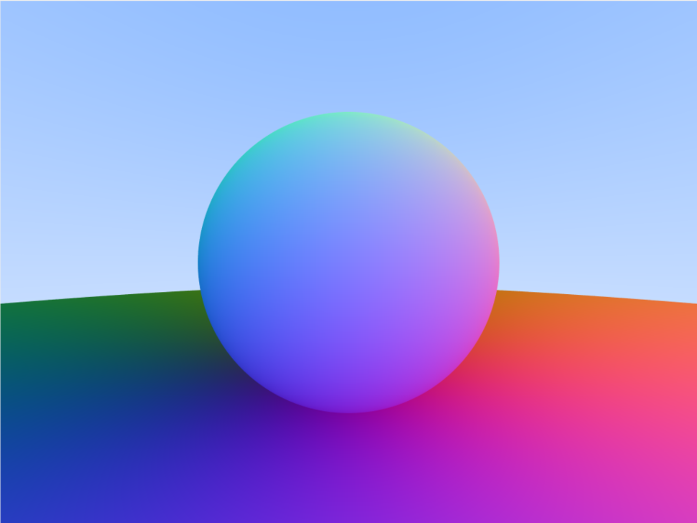
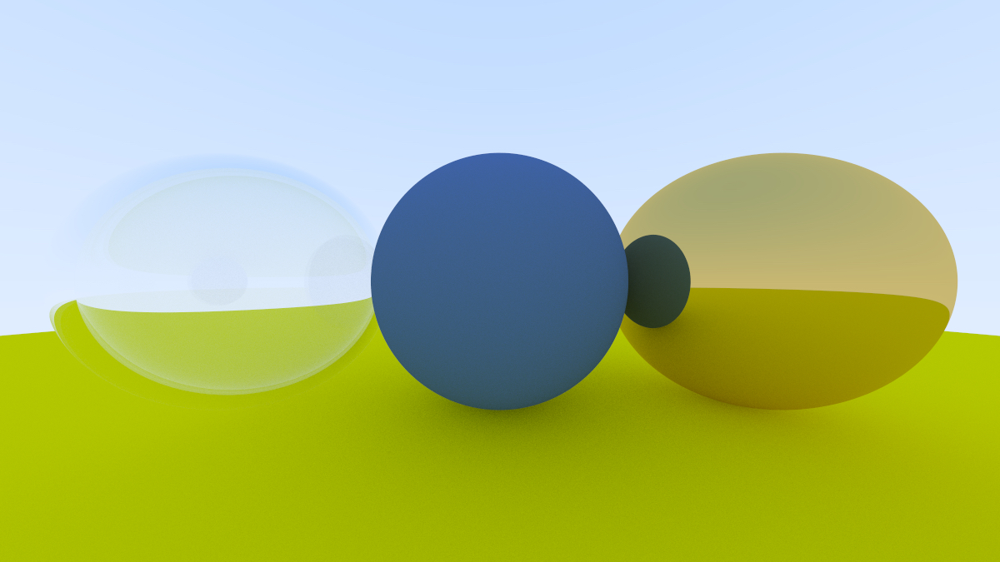
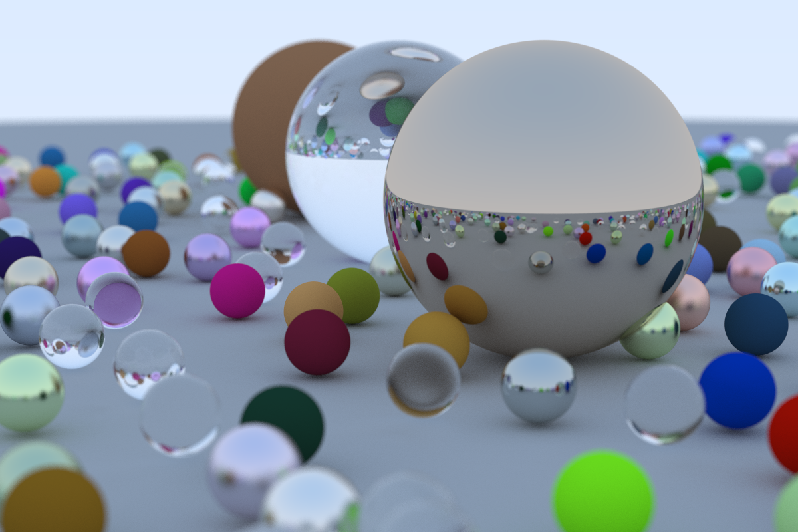
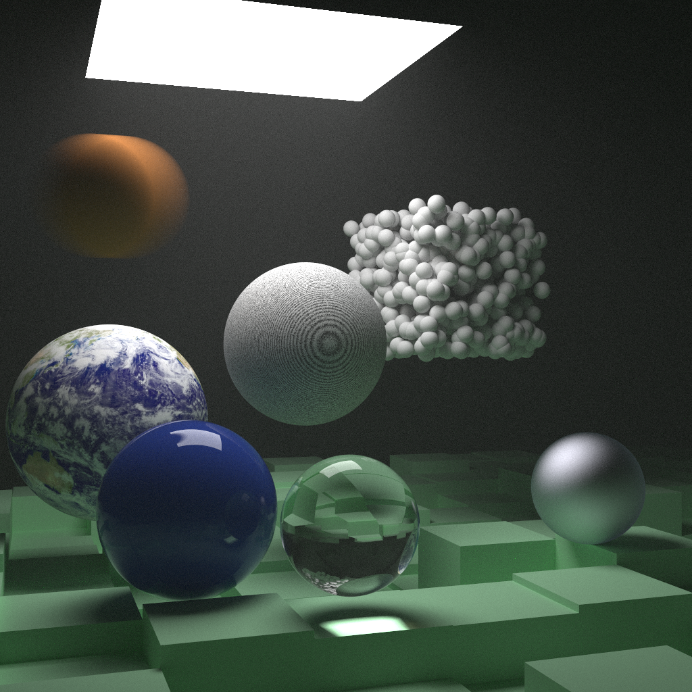
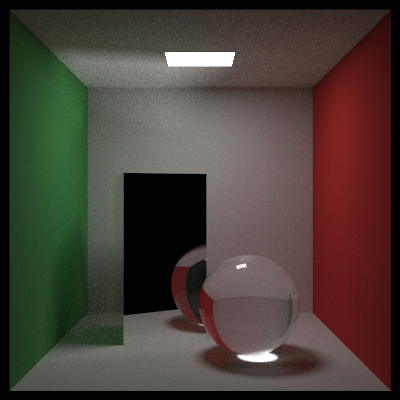

# Aegis: Ray Tracing Project (CUDA)

Aegis is an experimental ray tracing engine implemented in [CUDA](https://blogs.nvidia.com/blog/what-is-cuda-2/), designed to explore fundamental concepts of [GPU-accelerated](https://www.youtube.com/watch?v=-P28LKWTzrI) rendering. The project combines essential ray tracing techniques with the parallel computing power of modern GPUs, serving as a hands-on exploration of [Monte Carlo](https://en.wikipedia.org/wiki/Monte_Carlo_method) integration, light transport, and scene management. It aims to provide a solid foundation for understanding core principles of ray tracing and CUDA programming, while delivering visually compelling results.

## Key Features

- **CUDA-Accelerated Rendering**: Leverages the parallel processing capabilities of GPUs to accelerate ray tracing, providing an accessible entry point into high-performance computing.
- **Basic Monte Carlo Integration**: Implements Monte Carlo methods for light sampling and scattering, laying the groundwork for understanding more advanced rendering techniques.
- **Fundamental Light Scattering Models**: Includes basic scattering models and importance sampling, enabling exploration of how light interacts with surfaces and volumes.
- **Dynamic Scene Capabilities**: Supports motion blur and defocus blur to illustrate the effects of camera and object motion on rendering.
- **Optimized Scene Traversal**: Uses [Bounding Volume Hierarchies](https://en.wikipedia.org/wiki/Bounding_volume_hierarchy) (BVH) to demonstrate efficient spatial partitioning, reducing computation time for ray-object intersections.
- **Texture and Material Basics**: Provides support for simple texture mapping and basic material properties, offering a practical way to learn about shading and surface details.
- **Extensible Framework**: A modular structure that allows for easy experimentation with different rendering techniques and scene configurations, making it ideal for learning and expanding on core concepts.

For more information on the development history and features of previous versions, please refer to the [version history here](docs/VERSION_HISTORY.md).

## Performance

| Hardware Configuration         | Implementation | Technical Specifications                                                                                                                                              | Render Time           | Image                                |
| ------------------------------ | -------------- | --------------------------------------------------------------------------------------------------------------------------------------------------------------------- | --------------------- | ------------------------------------ |
| **MacBook Air M2 (2023)**      | C++ (Helios)   | **CPU:** 8-core Apple M2 (4x Performance, 4x Efficiency)   **GPU:** 10-core Apple M2   **RAM:** 16 GB Unified   **OS:** macOS 13                             | 7 hours 32 minutes    |  |
| **Google Cloud (NVIDIA T4)**   | CUDA (Aegis)   | **GPU:** NVIDIA T4   **CUDA Cores:** 2560   **VRAM:** 16 GB GDDR6   **Compute Capability:** 7.5   **Driver:** CUDA 11.2                                   | 46 minutes 22 seconds |  |
| **Google Cloud (NVIDIA V100)** | CUDA (Aegis)   | **GPU:** NVIDIA Tesla V100   **CUDA Cores:** 5120   **Tensor Cores:** 640   **VRAM:** 32 GB HBM2   **Compute Capability:** 7.0   **Driver:** CUDA 11.2 | 15 minutes 47 seconds |  |
| **Google Cloud (NVIDIA A100)** | CUDA (Aegis)   | **GPU:** NVIDIA A100   **CUDA Cores:** 6912   **Tensor Cores:** 432   **VRAM:** 40 GB HBM2   **Compute Capability:** 8.0   **Driver:** CUDA 11.4       | 5 minutes 2 seconds   |  |

### Speedup Analysis

1. **MacBook Air M2 (2023) vs. Google Cloud (NVIDIA T4)**:

   - Speedup Factor: $\frac{7 \text{ hours } 32 \text{ minutes}}{46 \text{ minutes } 22 \text{ seconds}} \approx 9.8$
   - The NVIDIA T4 offers a speedup of nearly 10x, leveraging its 2560 CUDA cores to significantly outperform the CPU-based implementation.

2. **MacBook Air M2 (2023) vs. Google Cloud (NVIDIA V100)**:

   - Speedup Factor: $\frac{7 \text{ hours } 32 \text{ minutes}}{15 \text{ minutes } 47 \text{ seconds}} \approx 28.6$
   - The V100 achieves a 28.6x speedup, demonstrating its capability to handle intensive computations with its powerful 5120 CUDA cores and high-bandwidth memory.

3. **MacBook Air M2 (2023) vs. Google Cloud (NVIDIA A100)**:
   - Speedup Factor: $\frac{7 \text{ hours } 32 \text{ minutes}}{5 \text{ minutes } 2 \text{ seconds}} \approx 89.8$
   - The A100 provides an impressive 89.8x speedup, showcasing the advantages of its 6912 CUDA cores and advanced architecture for complex rendering tasks.

## Gallery

Explore some of the additional renders created using Aegis:

| Render                  | Description                                                                          | Image                                                  |
| ----------------------- | ------------------------------------------------------------------------------------ | ------------------------------------------------------ |
| **Anti-Aliasing**       | Demonstrates the effect of anti-aliasing on sharp edges.                             |             |
| **Reflect and Refract** | Demonstrates reflection and refraction effects with a transparent object.            |  |
| **Book 1 Cover**        | Final render for Version 1 setup.                                                    |               |
| **Book 2 Cover**        | Final render showcasing features from Version 2, including textures and motion blur. |       |
| **Cornell Box**         | A Cornell Box with a glass sphere and mirror.                                        |     |

## Acknowledgements

This project was heavily influenced by the _Ray Tracing_ series by **Peter Shirley**, which provided the foundational knowledge and framework for building Aegis. The books in this series—_Ray Tracing in One Weekend_, _Ray Tracing: The Next Week_, and _Ray Tracing: The Rest of Your Life_—are excellent resources for anyone interested in learning about the fundamentals of ray tracing.

### Additional Resources

- **NVIDIA Developer Blog**: [Accelerated Ray Tracing in One Weekend in CUDA](https://developer.nvidia.com/blog/accelerated-ray-tracing-cuda/)
- **PBRT (Physically Based Rendering)** by Matt Pharr, Wenzel Jakob, and Greg Humphreys: An in-depth guide to advanced rendering techniques. [Book Website](http://www.pbrt.org/)
- **"An Efficient and Physically Realistic Lighting Model for Computer Graphics"** by Turner Whitted: The original paper introducing recursive ray tracing. [Paper Link](https://dl.acm.org/doi/10.1145/358876.358881)
- **"A Survey of Monte Carlo Methods for Light Transport Simulation in Computer Graphics"** by Kelemen et al.: Comprehensive overview of Monte Carlo methods used in rendering. [Paper Link](https://link.springer.com/chapter/10.1007/978-3-540-29945-7_23)
- **"Ray Tracing Gems"** by Eric Haines and Tomas Akenine-Möller: A collection of state-of-the-art ray tracing techniques. [Book Website](http://www.realtimerendering.com/raytracinggems/)
- **CUDA Programming Guide** by NVIDIA: Essential reading for understanding CUDA's parallel programming model. [Documentation](https://docs.nvidia.com/cuda/cuda-c-programming-guide/index.html)

These resources have been invaluable in guiding the development of Aegis, and we highly recommend them to anyone looking to deepen their understanding of ray tracing and GPU programming.
